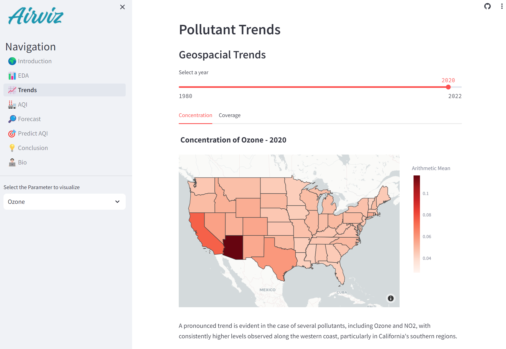

# AirViz

The goal of this webapp is to help users understand more about the air we breath.

Tryout the hosted version of this app [here](https://siva-airviz2.streamlit.app/)

## Datasets

The [EPA Air Quality Dataset](https://www.epa.gov/outdoor-air-quality-data) is a valuable resource provided by the United States Environmental Protection Agency (EPA) that offers a comprehensive and detailed record of air quality measurements across the United States.
With a wide range of spatial and temporal granularity, the EPA's air quality dataset allows us to track air quality levels over time and across different locations, helping us understand the impact of air pollution on public health and the environment.
Whether you're interested in studying long-term trends, assessing the effectiveness of air quality regulations, or simply gaining insights into local air quality, this dataset is an essential tool for making informed decisions and taking action to protect the air we breathe.


## Features
Air quality is a critical aspect of our environment that directly impacts the health and well-being of individuals and the ecosystems we inhabit. It refers to the measurement of various pollutants and particulate matter in the atmosphere, which can have adverse effects on human health and the environment.

### Geospacial Trends


### Temporal Trends


### Air quality metric plots


### Forecasting Trends


## Installation
1. Clone the repo to local:
```shell
git clone https://github.com/SivaTSS/AirViz.git
```
2. Install the required dependencies:
```shell
pip install -r requirements.txt
```

## Usage
On the terminal run the below command to launch streamlit:
```shell
streamlit run 🌍_Introduction.py
```
The app will be available on http://localhost:8501/